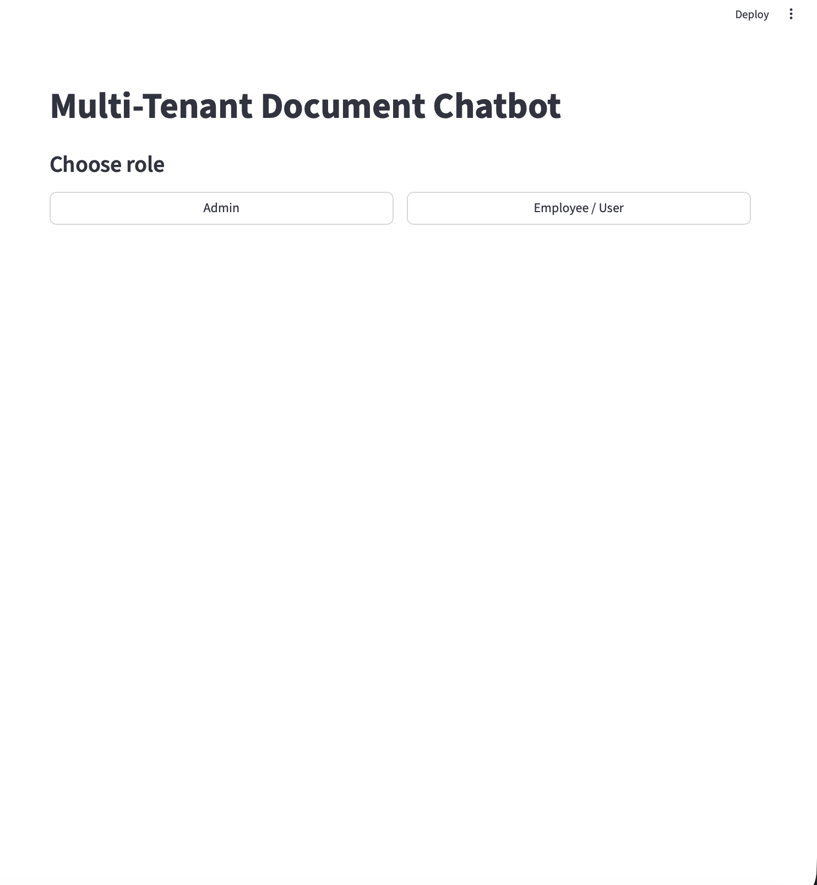

# Configurable Multi-Tenant Conversational RAG Platform

A production-style **multi-tenant Retrieval-Augmented Generation (RAG)** platform where **organizations (admins)** can create **role-specific topics/agents**, upload proprietary documents, and give **employees/users** access to chat with **citation-grounded** answers.

The system supports:
- **Per-topic document isolation** using **Pinecone namespaces**
- **Per-user chat history** stored in **PostgreSQL**
- **Hybrid conversational behavior**:
  - Small talk 
  - Memory questions from chat history (“what was my first question?”)
  - RAG answers grounded in uploaded docs  (with citations)
  - Safe fallback when documents don’t contain the answer 

---

## Key Features

###  Multi-Tenant Topics (Role-Specific Agents)
- Admin creates **topics** like “HR Policy”, “Engineering Wiki”, “Onboarding”, etc.
- Each topic has a **behavior prompt** that defines role, tone, and rules.
- **Employees only see topics they are added to**.

###  Secure Admin + User Modes (Product-Style)
- **Admin mode**:
  - One-time bootstrap “Create First Admin”
  - Admin login via token (`X-Admin-Token`)
  - Create topics, upload documents, add employees to topics
- **User mode**:
  - Login via username
  - Select topic
  - Chat with RAG + memory + fallback

###  Citation-Grounded Answers (RAG)
- Documents are chunked and embedded with **MiniLM**.
- Retrieval via **Pinecone vector search**.
- Results reranked with **Cross-Encoder (ms-marco-MiniLM-L-6-v2)**.
- Final answer includes **citations** (source + page when available).

###  Conversation Memory (PostgreSQL)
- Stores per-user (and per-topic) chat history.
- Supports memory-only questions like:
  - “What was my first question?”
  - “Summarize our conversation”
  - “What did I say last time?”

### Safe Fallback (When Docs Don’t Contain Answer)
When context doesn’t contain the answer:
> “I don’t know this based on the provided documents. But here is what I know about it: …”

This makes the chatbot useful even when retrieval is empty, while remaining honest.

---

## Tech Stack

**Backend**
- FastAPI
- PostgreSQL (chat history, users, topics, membership, admin sessions)
- Pinecone (vector DB + namespaces per topic)
- LangChain + Gemini (response generation)
- HuggingFace MiniLM embeddings
- Cross-Encoder reranker

**Frontend**
- Streamlit (Admin/User UI)

**Evaluation**
- `eval.py` to compute:
  - Recall@5 / Recall@10
  - MRR
  - Retrieval latency & response latency
  - (Optional) citation hit + semantic similarity when Gemini quota allows

---

## Architecture Overview

**Ingestion**
1. Admin uploads PDFs/TXTs to a topic
2. Backend extracts text → chunks (RecursiveCharacterTextSplitter)
3. Embeddings created via MiniLM
4. Upsert vectors into Pinecone under the topic’s namespace

**Query**
1. User selects topic and asks a question
2. Intent routing:
   - Small talk → direct response
   - Memory → answers only from chat history
   - Knowledge → retrieval + rerank + RAG answer
3. RAG response returns JSON with answer + citations
4. Postgres stores chat history

---

## Project Structure
# Configurable Multi-Tenant Conversational RAG Platform

A production-style **multi-tenant Retrieval-Augmented Generation (RAG)** platform where **organizations (admins)** can create **role-specific topics/agents**, upload proprietary documents, and give **employees/users** access to chat with **citation-grounded** answers.

The system supports:
- **Per-topic document isolation** using **Pinecone namespaces**
- **Per-user chat history** stored in **PostgreSQL**
- **Hybrid conversational behavior**:
  - Small talk 
  - Memory questions from chat history  (“what was my first question?”)
  - RAG answers grounded in uploaded docs  (with citations)
  - Safe fallback when documents don’t contain the answer 

---

## Key Features

###  Multi-Tenant Topics (Role-Specific Agents)
- Admin creates **topics** like “HR Policy”, “Engineering Wiki”, “Onboarding”, etc.
- Each topic has a **behavior prompt** that defines role, tone, and rules.
- **Employees only see topics they are added to**.

###  Secure Admin + User Modes (Product-Style)
- **Admin mode**:
  - One-time bootstrap “Create First Admin”
  - Admin login via token (`X-Admin-Token`)
  - Create topics, upload documents, add employees to topics
- **User mode**:
  - Login via username
  - Select topic
  - Chat with RAG + memory + fallback

###  Citation-Grounded Answers (RAG)
- Documents are chunked and embedded with **MiniLM**.
- Retrieval via **Pinecone vector search**.
- Results reranked with **Cross-Encoder (ms-marco-MiniLM-L-6-v2)**.
- Final answer includes **citations** (source + page when available).

###  Conversation Memory (PostgreSQL)
- Stores per-user (and per-topic) chat history.
- Supports memory-only questions like:
  - “What was my first question?”
  - “Summarize our conversation”
  - “What did I say last time?”

###  Safe Fallback (When Docs Don’t Contain Answer)
When context doesn’t contain the answer:
> “I don’t know this based on the provided documents. But here is what I know about it: …”

This makes the chatbot useful even when retrieval is empty, while remaining honest.

---

## Tech Stack

**Backend**
- FastAPI
- PostgreSQL (chat history, users, topics, membership, admin sessions)
- Pinecone (vector DB + namespaces per topic)
- LangChain + Gemini (response generation)
- HuggingFace MiniLM embeddings
- Cross-Encoder reranker

**Frontend**
- Streamlit (Admin/User UI)

**Evaluation**
- `eval.py` to compute:
  - Recall@5 / Recall@10
  - MRR
  - Retrieval latency & response latency
  - (Optional) citation hit + semantic similarity when Gemini quota allows

---

## Architecture Overview

**Ingestion**
1. Admin uploads PDFs/TXTs to a topic
2. Backend extracts text → chunks (RecursiveCharacterTextSplitter)
3. Embeddings created via MiniLM
4. Upsert vectors into Pinecone under the topic’s namespace

**Query**
1. User selects topic and asks a question
2. Intent routing:
   - Small talk → direct response
   - Memory → answers only from chat history
   - Knowledge → retrieval + rerank + RAG answer
3. RAG response returns JSON with answer + citations
4. Postgres stores chat history

---

## Project Structure
RAGBOT/
backend/
main.py # FastAPI backend (auth, topics, query pipeline)
admin_auth.py # admin hashing/token/session utilities
create_tables.py # DB schema creation
db.py # DB helpers (if used)
guardrails/ # grounded policy checks
retrieval/ # retrieval utilities (optional)
requirements.txt
frontend/
app.py # Streamlit UI (Admin/User)
eval.py # evaluation script
eval_set*.json # evaluation datasets


---

## Setup Instructions

### 1) Create Python environment
```bash
python3 -m venv venv
source venv/bin/activate
pip install -r backend/requirements.txt

## **2)Environment Variables**

Create a `.env` file in the project root and add:

```env
# Database
DATABASE_URL=your_postgresql_connection_string

# Pinecone
PINECONE_API_KEY=your_pinecone_api_key
PINECONE_INDEX_NAME=your_index_name
PINECONE_CLOUD=aws
PINECONE_REGION=us-east-1

# BM25 index path
BM25_PATH=bm25.json

# Gemini
GOOGLE_API_KEY=your_google_api_key

##**3)Create DB tables**
python backend/create_tables.py

##**4)Run backend**
python -m uvicorn backend.main:app --reload --port 8000

##**5)Run frontend**
streamlit run frontend/app.py

##**How to Use (Demo Flow)**
1.Admin Flow

2.Choose Admin

3.If first time → Create First Admin

4.Create a topic + behavior prompt 

5.You have a option to improe the prompt , so the prompt can be improved

6.Upload PDF/TXT documents into that topic

7.Add employees to the topic by username

##**User Flow**
1.Choose Employee/User

2.Login with username

3.Select topic

4.Ask questions:

  *Small talk: “hi”

  *RAG: “What is the perinuclear space?”

  *Memory: “What was my first question?”

##**Evaluation**
**Option A (Retrieval-Only Evaluation) ✅ Most reliable**
source venv/bin/activate
export USER_ID="User ID"
export TOPIC_ID="Topic ID"
export EVAL_SET=eval_set_nucleus.json
export SKIP_QUERY=1
python eval.py

**Option B (Full Pipeline Evaluation: retrieval + answer)**
export SKIP_QUERY=0
export TIMEOUT=180
export ANSWER_DELAY_SEC=5
python eval.py

## Demo (Screenshots)

This section shows the end-to-end workflow of the platform: **Admin setup → Topic creation → Document upload → Member access → User chat → Pinecone verification → Evaluation**.

> All screenshots are stored in: `docs/screenshots/`

---

### 1) App Landing / Role Selection
Users start on the landing page and choose between **Admin** and **Employee/User** modes.


---

### 2) Admin Login
Admin authentication screen used to access protected actions like creating topics, uploading documents, and managing members.


---

### 3) Admin Dashboard (Overview)
Admin dashboard entry point showing the full workflow sections:
- Create Topic
- Select Topic
- Upload Documents
- Add Employee/User to Topic


---

### 4) Create Topic (Draft Prompt)
Admin enters a **topic name** and a **draft topic behavior prompt** (role-specific instruction set for that topic).
.png)

---

### 5) Topic Created (Admin View)
Topic is successfully created and becomes selectable in the admin dashboard.
.png)

---

### 6) Improve Prompt (Auto Prompt Engineering)
Admin clicks **Improve Prompt** to automatically rewrite the draft into a stronger, system-ready topic behavior prompt (grounded + citation rules + safety).
.png)

---

### 7) Upload Documents to Topic
Admin uploads PDF/TXT files into the selected topic. These documents are chunked, embedded, and stored in Pinecone under the topic’s namespace.
.png)

---

### 8) User Login (Employee/User)
An employee logs in (or signs up). The system assigns them a user_id and loads only the topics they have access to.


---

### 9) User Chat (RAG + Fallback Behavior)
User chats inside a selected topic:
- Topic-grounded questions return **document-based answers**.
- Out-of-scope questions trigger the fallback response format.


---

### 10) Pinecone Dashboard (Index View)
Pinecone index view showing the vector database is populated and operational.


---

### 11) Pinecone Namespace (Topic Isolation)
The **namespace** view confirms multi-tenant isolation: each topic’s embeddings are stored in a separate namespace.


---

### 12) Evaluation Results (Retrieval-Only Metrics)
Evaluation script validates retrieval quality using:
- Recall@5
- Recall@10
- MRR
.png)

---

### 13) Evaluation Results (Retrieval-Only Continued)
Additional retrieval-only evaluation output (full test set).
.png)

---

### 14) Evaluation Results (Retrieval + Semantic Similarity)
Extended evaluation including:
- Retrieval metrics (Recall@K, MRR)
- Semantic similarity score (answer vs expected answer)
.png)
